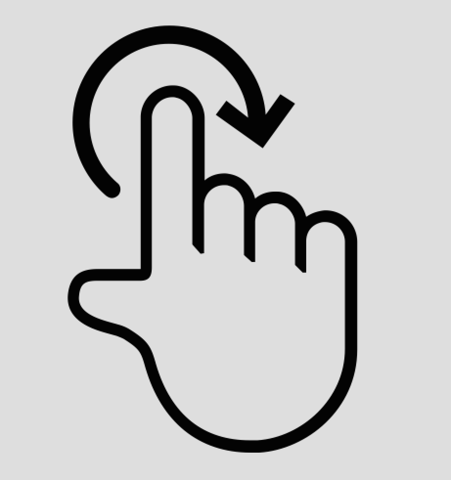

# Hello World

# Print Numbers from 1 to 10

# Some Thoughts

* One goal of this language was to make the gestures/movements/symbols for complex actions such as "loop" and "print" intuitive for the human reader/viewer to grasp.
* Maybe ironically, using flag semaphore for alphanumeric characters did not feel very intuitive. In particular, the re-use of the same movements/symbols for letters and numbers keeps the character space small, but increases the length and visual confusion of messages/programs that involve both.
