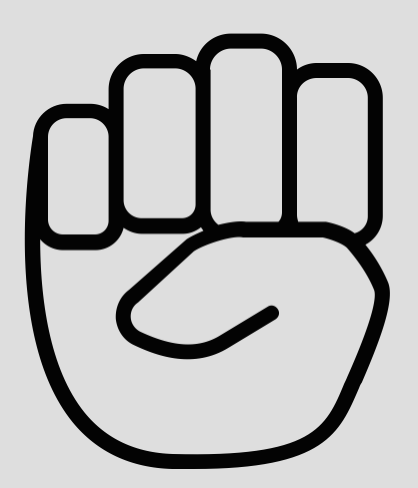
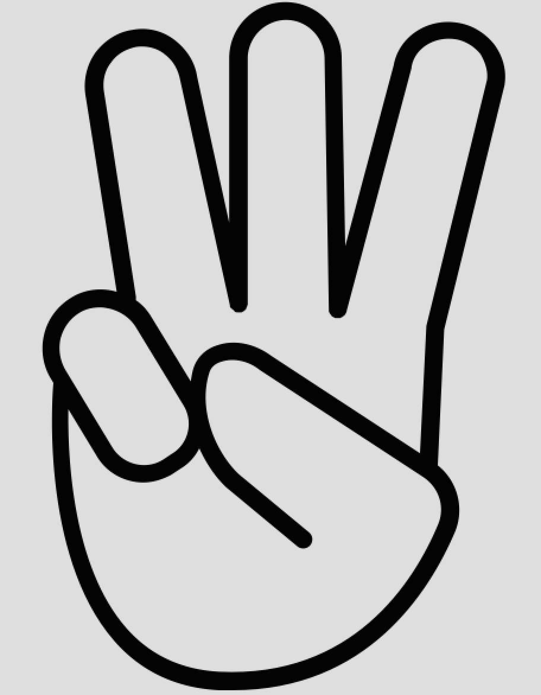
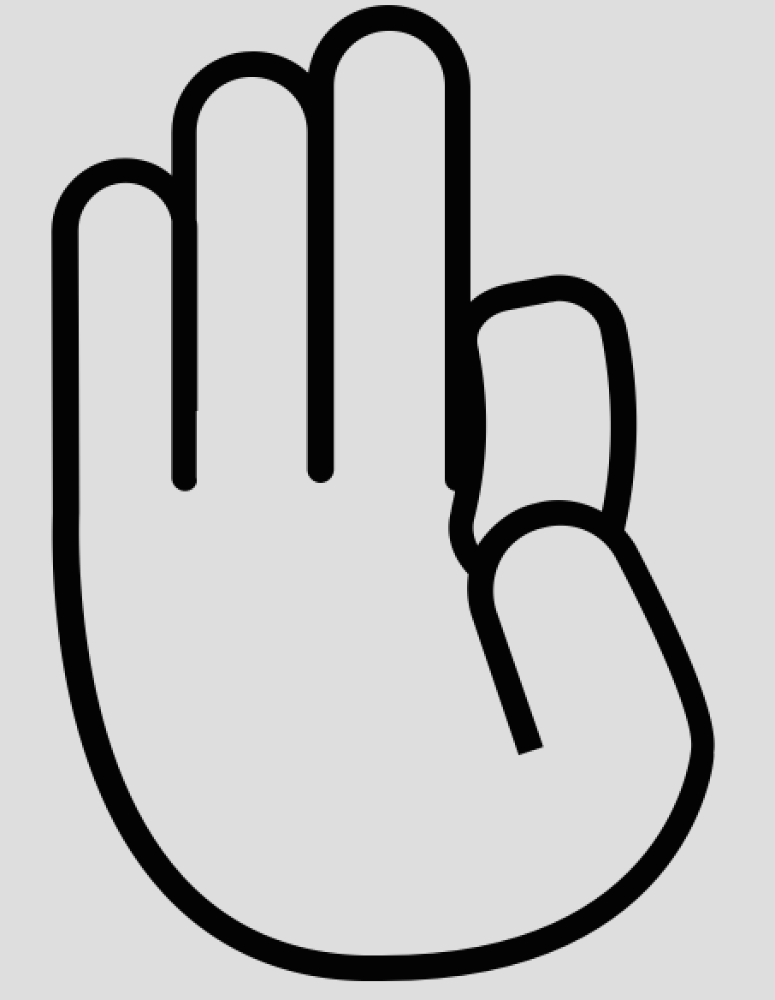

# Important Note
In designing this language, I've drawn on ASL (American Sign Language) for finger-spelling and numerical signing. I don't know ASL, and I'm sure that someone who does would make very different choices if they were to design something like this. If this were a long-term project rather than a homework assignment done over the course of 3-4 days, I would absolutely invest some time upfront in learning ASL before trying to make a gestural programming language.

# Hello World

\**pause*\*

